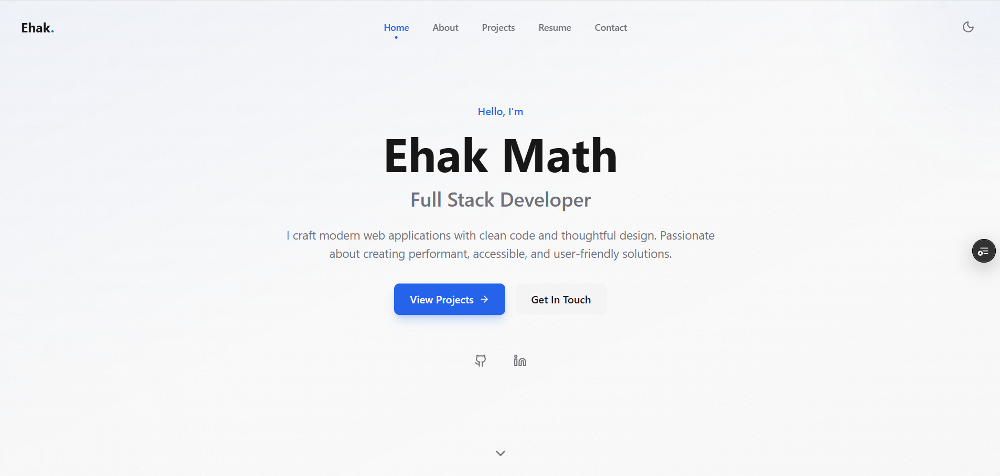

# Math Ehak - Portfolio Website

A modern, professional portfolio website built with Next.js 14+, TypeScript, Tailwind CSS, and Framer Motion.



## ✨ Features

- **Modern Tech Stack**: Next.js 14+ (App Router), TypeScript, Tailwind CSS
- **Smooth Animations**: Framer Motion for page transitions and scroll animations
- **Dark/Light Mode**: System-aware theme with manual toggle
- **Responsive Design**: Mobile-first approach, looks great on all devices
- **SEO Optimized**: Proper meta tags, OpenGraph, and semantic HTML
- **Performance**: Optimized images, lazy loading, and fast page loads
- **Accessible**: ARIA labels, keyboard navigation, and focus management

## 📁 Project Structure

```
portfolio-next/
├── app/
│   ├── layout.tsx          # Root layout with providers
│   ├── page.tsx            # Home page
│   ├── about/
│   │   └── page.tsx        # About page
│   ├── projects/
│   │   └── page.tsx        # Projects page
│   ├── resume/
│   │   └── page.tsx        # Resume page
│   ├── contact/
│   │   └── page.tsx        # Contact page
│   └── globals.css         # Global styles
├── components/
│   ├── AnimatedSection.tsx # Scroll animation wrapper
│   ├── ContactForm.tsx     # Contact form with validation
│   ├── Footer.tsx          # Site footer
│   ├── Hero.tsx            # Hero section component
│   ├── Navbar.tsx          # Navigation with mobile menu
│   ├── PageTransition.tsx  # Page transition wrapper
│   ├── ProjectCard.tsx     # Project card component
│   ├── SkillBar.tsx        # Skill visualization
│   ├── ThemeProvider.tsx   # Dark/light mode provider
│   ├── Timeline.tsx        # Experience timeline
│   └── index.ts            # Component exports
├── lib/
│   ├── data.ts             # Site data and configuration
│   └── utils.ts            # Utility functions
└── public/
    └── projects/           # Project images
```

## 🚀 Getting Started

### Prerequisites

- Node.js 18.17 or later
- npm, yarn, pnpm, or bun

### Installation

1. Clone the repository:
```bash
git clone https://github.com/alexchen/portfolio-next.git
cd portfolio-next
```

2. Install dependencies:
```bash
npm install
# or
yarn install
# or
pnpm install
```

3. Run the development server:
```bash
npm run dev
# or
yarn dev
# or
pnpm dev
```

4. Open [http://localhost:3000](http://localhost:3000) in your browser.

## ⚙️ Configuration

### Personal Information

Edit `lib/data.ts` to customize your portfolio:

```typescript
export const siteConfig = {
  name: "Your Name",
  role: "Your Role",
  tagline: "Your tagline",
  description: "Your description",
  email: "your@email.com",
  location: "Your Location",
  social: {
    github: "https://github.com/yourusername",
    linkedin: "https://linkedin.com/in/yourusername",
    twitter: "https://twitter.com/yourusername",
  },
  resumeUrl: "/resume.pdf",
};
```

### Adding Projects

Add new projects to the `projects` array in `lib/data.ts`:

```typescript
{
  id: 7,
  title: "Project Title",
  description: "Project description",
  image: "/projects/project-image.jpg",
  technologies: ["React", "TypeScript", "Tailwind"],
  github: "https://github.com/...",
  demo: "https://project-demo.com",
  featured: true,
}
```

### Customizing Colors

Edit the CSS variables in `app/globals.css`:

```css
:root {
  --primary: #2563eb;        /* Primary color */
  --background: #fafafa;     /* Background color */
  --foreground: #171717;     /* Text color */
  /* ... more variables */
}

.dark {
  --primary: #3b82f6;        /* Dark mode primary */
  --background: #09090b;     /* Dark mode background */
  --foreground: #fafafa;     /* Dark mode text */
  /* ... more variables */
}
```

## 🎨 Customization

### Adding New Pages

1. Create a new folder in `app/`:
```bash
mkdir app/blog
```

2. Create `page.tsx`:
```typescript
import { Metadata } from "next";
import PageTransition from "@/components/PageTransition";

export const metadata: Metadata = {
  title: "Blog",
  description: "My blog posts",
};

export default function BlogPage() {
  return (
    <PageTransition>
      {/* Your content */}
    </PageTransition>
  );
}
```

3. Add to navigation in `lib/data.ts`:
```typescript
export const navLinks = [
  // ... existing links
  { name: "Blog", href: "/blog" },
];
```

### Animation Customization

Adjust animation settings in `components/AnimatedSection.tsx`:

```typescript
// Change animation direction
direction="up" | "down" | "left" | "right" | "none"

// Adjust timing
delay={0.2}
duration={0.5}
```

## 📦 Technologies Used

- **Framework**: [Next.js 14+](https://nextjs.org/)
- **Language**: [TypeScript](https://www.typescriptlang.org/)
- **Styling**: [Tailwind CSS 4](https://tailwindcss.com/)
- **Animations**: [Framer Motion](https://www.framer.com/motion/)
- **Icons**: [Lucide React](https://lucide.dev/)
- **Fonts**: [Geist](https://vercel.com/font)

## 🚀 Deployment

### Deploy on Vercel

The easiest way to deploy is using [Vercel](https://vercel.com):

[](https://vercel.com/new)

1. Push your code to GitHub
2. Import your repository on Vercel
3. Vercel will automatically detect Next.js and deploy

### Build for Production

```bash
npm run build
npm run start
```

## 📝 License

This project is open source and available under the [MIT License](LICENSE).

## 🤝 Contributing

Contributions, issues, and feature requests are welcome! Feel free to check the [issues page](https://github.com/alexchen/portfolio-next/issues).

## 📧 Contact

Math Ehak - [mathehak@example.com](mailto:mathehak@example.com)

Project Link: [https://github.com/mathehak/portfolio-next](https://github.com/mathehak/portfolio-next)
